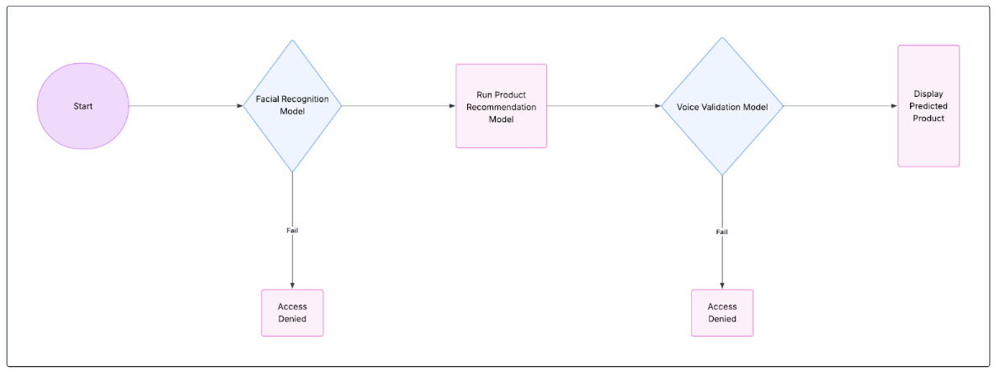

# GROUP 4 -  Formative 2: Project Documentation: RekomAI

## **0. Information**
1. Resources:
   1. [Github](https://github.com/Christianib003/rekomai)
   2. [Video Demo](https://youtu.be/uCQN-QOQB0U)

## **1. Introduction**

### **1.1 Project Overview**

This document provides a comprehensive overview of **RekomAI**, a Multimodal User Authentication and Product Recommendation System developed as part of the Machine Learning Pipeline course. The system is designed to offer a secure and personalized user experience by integrating advanced biometric authentication with a data-driven recommendation engine.

The core concept is a sequential, two-factor authentication process. Before a user can receive a product recommendation, they must first be positively identified through a facial recognition scan. Following this, their identity must be confirmed through a voiceprint verification. This dual-layered security ensures that only authorized users can access the recommendation engine, protecting user data and ensuring the integrity of the system.

### **1.2 Project Objectives**

The primary goal of this project is to design, build, and evaluate a complete machine learning pipeline that handles multimodal data (images, audio, and tabular data). The key objectives are as follows:

* **Develop a Facial Recognition Model:** To build a robust classifier capable of accurately identifying registered users from facial images.
* **Develop a Voice Verification Model:** To create a model that can confirm a user's identity based on the unique characteristics of their voice.
* **Develop a Product Recommendation Model:** To construct a predictive model that suggests products a user is likely to purchase based on their social media engagement and transaction history.
* **Integrate Models into a Cohesive System:** To combine the three models into a single, functional command-line application that simulates the end-to-end user journey.
* **Evaluate and Document Performance:** To rigorously evaluate each model using appropriate metrics (Accuracy, F1-Score, and Loss) and to document the entire process, from data collection to final implementation.

### **1.3 Scope**

The scope of this project includes all steps necessary to create a functional proof-of-concept for the system. This encompasses:

* **Data Collection and Preprocessing:** Gathering and cleaning all required image, audio, and tabular data.
* **Feature Engineering and Augmentation:** Creating meaningful features from the raw data to train the models.
* **Model Training and Evaluation:** Building and testing the three core machine learning models.
* **System Simulation:** Developing a command-line interface to demonstrate the full authentication and recommendation flow.

**Out of Scope:**

* This project does not include the development of a graphical user interface (GUI) or a front-end application.
* The system is not intended for deployment in a live, production environment and is for educational and demonstrative purposes only.


## **2. System Architecture**

The RekomAI system is designed with a modular, multi-stage architecture that separates the data processing, model training, and final application logic. This ensures that each component can be developed, tested, and maintained independently. The architecture follows a standard machine learning pipeline, flowing from raw data ingestion to a final, interactive user simulation.

The diagram(s) below illustrates the high-level architecture of the RekomAI system:
1. **User Flow Diagram**


2. **Architecture Flow**
```
[Raw Data] -> [Data Processing Pipeline] -> [Processed Features] -> [Modeling Pipeline] -> [Saved Model Artifacts] -> [Application Layer] -> [User]
```

### **2.1 Component Breakdown**

The system is composed of four primary components:

#### **2.1.1 Data Processing Pipeline**

This initial stage is responsible for all data ingestion and preparation. It takes the raw multimodal data as input:

  * **Tabular Data**: `customer_social_profiles.csv` and `customer_transactions.csv`.
  * **Image Data**: `.jpg` facial images collected from team members.
  * **Audio Data**: `.wav`, `.aac`, and `.ogg` voice samples.

This pipeline, primarily managed in the `01_Data_Processing.ipynb` notebook, performs cleaning, merging (for tabular data), extensive augmentation (for images and audio), and feature extraction. The output of this stage is a set of clean, processed feature files (`.csv`) ready for model training.

#### **2.1.2 Modeling Pipeline**

The core machine learning development takes place in the `/model` folder. This component consumes the processed feature sets and is responsible for:

  * Training three distinct models: **Facial Recognition**, **Voice Verification**, and **Product Recommendation**.
  * Systematically evaluating multiple algorithms and performing hyperparameter tuning to select the best model for each task.
  * Generating performance reports and visualizations (e.g., confusion matrices, feature importance) to analyze model effectiveness.

#### **2.1.3 Model Artifacts**

Once the best models are selected, they are serialized and saved to disk along with their necessary preprocessors. These artifacts, stored in the `/models` directory, include:

  * Trained model files (e.g., `face_recognition_model.pkl`).
  * Fitted scalers (e.g., `StandardScaler`).
  * Fitted label encoders.

This creates a persistent, reusable set of components that the final application can load and use for inference.

#### **2.1.4 Application Layer**

The final component is a modular Python package located in the `/scripts` directory. This layer serves as the user-facing command-line application (CLI). Its responsibilities include:

  * Loading the saved model artifacts.
  * Orchestrating the sequential authentication flow by calling the facial and voice models.
  * Calling the product recommendation model upon successful authentication.
  * Managing all user interaction through the command line.


## **3. Getting Started**

This section provides all the necessary instructions to set up the **RekomAI** project on a local machine, from cloning the repository to installing the required dependencies.

### **3.1 Prerequisites**

Before you begin, ensure you have the following software installed on your system:

  * **Git**: For version control and cloning the repository.
  * **Python**: The project was developed using **Python 3.11** or later.
  * **pip**: The package installer for Python, which typically comes with your Python installation.


### **3.2 Installation**

Follow these steps to get your development environment running:

1.  **Clone the repository:**
    Open your terminal or command prompt and run the following command to clone the project to your local machine.

    ```bash
    git clone https://github.com/Christianib003/rekomai.git
    ```

2.  **Navigate to the project directory:**

    ```bash
    cd rekomai
    ```

3.  **Create a virtual environment:**
    It is a best practice to use a virtual environment to isolate project dependencies.

    ```bash
    python -m venv .venv
    ```

4.  **Activate the virtual environment:**

      * **On Windows:**
        ```bash
        .\.venv\Scripts\activate
        ```
      * **On macOS/Linux:**
        ```bash
        source .venv/bin/activate
        ```

5.  **Install dependencies:**
    Install all the required Python libraries using the `requirements.txt` file.

    ```bash
    pip install -r requirements.txt
    ```

You are now ready to run the data processing notebooks and the final application.

### **3.3 Folder Structure**

The project is organized into the following structure to ensure a clear separation of concerns:

```
RekomAI/
├── data/                             # All project data.
│   ├── customer-info/                # Initial tabular data.
│   ├── images/                       # Raw facial images.
│   ├── audio/                        # Raw audio samples.
│   └── outputs/                      # Processed data outputs.
├── models/                           # Trained model artifacts.
│   ├── image/                        # Facial recognition model and preprocessors.
│   └── audio/                        # Voice verification model and preprocessors.
├── notebooks/                        # Development notebooks.
├── scripts/                          # Final application scripts.
│   ├── __init__.py                   # Makes 'scripts' a package.
│   ├── main.py                       # Main CLI application.
│   ├── auth.py                       # Authentication logic module.
│   └── utils.py
|    ├── recommendation.py                     # Feature extraction utilities.
├── .gitignore                        # Git ignore file.
└── requirements.txt                  # Project dependencies.
```


## **4. Technology Stack**

The RekomAI system was built using a curated set of industry-standard Python libraries and tools. This section outlines the key technologies that power the data processing, machine learning, and application components of the project.

### **4.1 Core Technologies**
* **Python 3.11**: The core programming language used for the entire project.
* **Jupyter Notebook**: The interactive development environment used for data exploration, feature engineering, and model training.

### **4.2 Data Science & Machine Learning**
* **Pandas**: The primary library for loading, manipulating, and cleaning all tabular data.
* **NumPy**: Used for high-performance numerical operations, especially during data augmentation.
* **Scikit-learn**: A comprehensive library used for numerous machine learning tasks, including:
    * Model training (`RandomForestClassifier`).
    * Data preprocessing (`StandardScaler`, `LabelEncoder`).
    * Model evaluation (`classification_report`, `confusion_matrix`, `log_loss`).
* **XGBoost**: An optimized gradient boosting library used to train a high-performance model for the product recommendation task.

### **4.3 Signal & Image Processing**
* **Librosa**: The key library for all audio analysis, including loading files, feature extraction (MFCCs), and data augmentation (pitch shifting, time stretching).
* **OpenCV (cv2)**: The primary tool for all image processing tasks, including loading images, applying augmentations, and extracting histogram features.

### **4.4 Data Visualization**
* **Matplotlib & Seaborn**: Used together to generate all visualizations, including waveforms, spectrograms, confusion matrices, and feature importance plots.

### **4.5 Model Persistence**
* **Joblib**: Used to serialize and save the trained machine learning models and preprocessors (`scaler`, `encoder`) to disk for later use by the application script.


## **5. Data Pipeline**

This section describes the end-to-end process of data management in the RekomAI project, from the initial raw sources to the final, engineered feature sets used to train the models.

### **5.1 Data Sources**
The project utilizes a combination of provided tabular data and custom-collected multimodal data.

* **Tabular Data**: The foundation of the product recommendation model consists of two provided datasets: `customer social profiles` and `customer transactions`. These files contain information about customer engagement on social media and their historical purchase details.
* **Image Data**: To build the facial recognition model, facial images were collected from each team member. Each member provided at least three images corresponding to specific expressions: **neutral, smiling, and surprised**.
* **Audio Data**: For the voice verification model, audio samples were recorded by each team member. Each member recorded at least two specific phrases: **"Yes, approve"** and **"Confirm transaction"**.

---
### **5.2 Data Preprocessing and Feature Engineering**

This subsection provides a detailed, factual account of the specific techniques used to clean the raw data and construct meaningful features for each data modality.

#### **Tabular Data Pipeline**
The two tabular datasets were first merged into a single DataFrame. The `purchase_date` column was engineered into five new numerical features: `year`, `month`, `day`, `weekday`, and `isweekend`. The `review_sentiment` column, being ordinal, was manually mapped to integers (`Negative`: 0, `Neutral`: 1, `Positive`: 2). All categorical features with no inherent order, such as `social_media_platform`, were converted into a numerical format using one-hot encoding. Finally, the target variable, `product_category`, was encoded using `LabelEncoder`.

#### **Image Data Pipeline**
To address the small size of the initial image dataset, a total of **14 unique augmentations** were applied to each original image to create a large and diverse training set. The specific transformations implemented included **positive and negative rotations, horizontal flipping, brightness increases and decreases, Gaussian blur, and the addition of random noise**, along with several combinations of these effects.

For **feature extraction**, each image (both original and all 14 augmented versions) was first converted to the HSV (Hue, Saturation, Value) color space. A 3D color histogram with 8 bins per channel was then calculated, resulting in a 512-dimensional feature vector (`8x8x8`). This vector was flattened and normalized to represent the color distribution of each image.

#### **Audio Data Pipeline**
To create a more robust training set for the voice model, **eight distinct augmentations** were applied to each original audio sample. These augmentations included **adding random noise, shifting the pitch both up and down, time-stretching the audio to be both slower and faster, time-shifting the signal (rolling), and creating combinations** of these techniques.

The **feature extraction** process converted each audio clip into a vector of **15 numerical features**. This vector was composed of the mean across time of **13 Mel-Frequency Cepstral Coefficients (MFCCs)** and the mean of the **spectral roll-off**. Two additional features, the **standard deviation and the range of the MFCCs**, were engineered during the model training phase to further enhance the feature set.

Of course. Adding the specific performance metrics to this section makes the documentation much more informative.

Here is the revised **Modeling Pipeline** section, now including the key results for each model.


## **6. Modeling Pipeline**

This section details the development, training, and selection process for the three core machine learning models in the RekomAI system. Each model was developed in the `02_Model_Training.ipynb` notebook, which consumed the feature sets created during the data pipeline stage.

### **6.1 Facial Recognition Model**
A **`RandomForestClassifier`** was chosen for its robustness and ability to provide feature importances. The model was trained on the augmented image feature set after the data was scaled using `StandardScaler`.

Upon evaluation, this model achieved excellent results, demonstrating a strong ability to identify users. The key performance metrics were:
* **Accuracy**: 0.9556
* **Weighted F1-Score**: 0.9539
* **Log Loss**: 0.1387

The model performed well across all classes, with only minor confusion in one class, making it a highly reliable component of the authentication system.

### **6.2 Voice Verification Model**
A systematic, competitive approach was taken where four different classification algorithms were trained and evaluated: Random Forest, XGBoost, SVM, and Logistic Regression. After tuning with `GridSearchCV`, the **`RandomForestClassifier`** was selected as the best-performing model based on its cross-validation score.

The final model achieved the following metrics on the test set:
* **Accuracy**: 75.0%
* **Weighted F1-Score**: 0.67

While this was the best model of the four, its performance was limited by the small dataset, showing some difficulty in perfectly classifying every speaker, as noted in its classification report.

### **6.3 Product Recommendation Model**
Multiple algorithms were explored to find the best fit for the tabular data. A **`RandomForestClassifier` tuned with `RandomizedSearchCV`** was identified as the best-performing model and was saved for the final application.

The final model demonstrated a strong predictive capability, achieving the following results:
* **Accuracy**: 74%
* **Weighted F1-Score**: 0.74

## **7. Evaluation and Results**

This section provides a consolidated summary of the final performance metrics for each of the three models developed for the RekomAI system. It also includes a higher-level analysis of these results and key observations from the modeling process.

### **7.1 Consolidated Performance Metrics**

The table below summarizes the performance of the final selected model for each component on its respective test set.

| Model | Accuracy | F1-Score (Weighted) | Log Loss |
| :--- | :---: | :---: | :---: |
| **Facial Recognition** | 95.6% | 0.95 | 0.1387 |
| **Voice Verification** | 75.0% | 0.67 | 0.171 |
| **Product Recommendation**| 74.0% | 0.74 | 1.04 |

### **7.2 Analysis and Observations**

* **Impact of Data Augmentation**: The data augmentation strategy was highly effective, particularly for the **Facial Recognition model**. Expanding the small set of original images into a large and diverse training set allowed the RandomForest model to achieve near-perfect classification, demonstrating high accuracy and an exceptional AUC score of 1.0 for all classes.

* **Data Quantity as a Limiting Factor**: While the **Voice Verification model** used a similar augmentation strategy, its performance was noticeably lower than the facial recognition model. This is primarily due to the limited number of unique speakers in the dataset. With only a few individuals, creating a model that can robustly generalize is challenging, which was reflected in its 75% accuracy. The model serves as a strong proof-of-concept but would require data from more speakers to be effective in a real-world scenario.

* **Model Suitability**: The exploration of multiple algorithms for the **Product Recommendation model** proved valuable. Tree-based models like RandomForest and XGBoost significantly outperformed a simple linear model (Logistic Regression), which only achieved 26% accuracy. This indicates that the relationships within the tabular data are complex and non-linear, making tree-based ensembles the appropriate choice.

## **8. System Usage**

This section provides instructions for running the RekomAI command-line interface (CLI) and simulating the two-factor authentication process.

### **8.1 Running the Application**

To run the system, follow these steps from your project's root directory:

1.  **Open a terminal** or command prompt.

2.  **Activate the virtual environment**:

      * **On Windows:**
        ```bash
        .\.venv\Scripts\activate
        ```
      * **On macOS/Linux:**
        ```bash
        source .venv/bin/activate
        ```

3.  **Execute the main script**:

    ```bash
    python -m scripts.main
    ```
    

## **9. Limitations and Future Work**

This section provides an honest assessment of the project's current limitations and suggests potential avenues for future development and improvement of the RekomAI system.

### **9.1 Limitations**
* **Dataset Size**: The most significant limitation of this project was the small dataset, particularly the low number of unique individuals. The **Voice Verification model**, trained on samples from only a few speakers, showed limited performance and struggled to generalize, as seen in its 75% accuracy.
* **Feature Extraction Methods**: The project relied on traditional feature extraction techniques (color histograms for images, MFCCs for audio). While effective for this proof-of-concept, these methods may not capture the complex nuances that more advanced techniques can.
* **Controlled Environment**: All image and audio data was collected in a controlled, low-noise environment. The models' performance would likely degrade in real-world scenarios with variable lighting, background noise, and different recording devices.
* **No Graphical User Interface (GUI)**: The system is operated via a command-line interface, which is not user-friendly for a non-technical end-user.

### **9.2 Future Work**
* **Data Expansion**: The highest priority for future work would be to collect a much larger and more diverse dataset with a significant number of unique users. This is essential for improving the accuracy and robustness of all models, especially the voice verification component.
* **Advanced Feature Extraction**: The models could be significantly improved by replacing traditional feature extraction with deep learning-based embeddings. Using pre-trained Convolutional Neural Networks (CNNs) like FaceNet for images and specialized audio networks (like VGGish) would provide much richer feature representations.
* **Real-World Robustness Testing**: The system should be tested with data collected in challenging, real-world conditions to identify and address performance gaps.
* **GUI Development**: Building a simple graphical user interface (e.g., using Tkinter or a web framework like Flask) would make the RekomAI system more accessible and intuitive for end-users.

## **10. Conclusion**

The **RekomAI** project successfully achieved its primary objective of designing and implementing a complete, multimodal machine learning pipeline. The project demonstrated the entire workflow, from data collection and extensive feature engineering to the training and evaluation of three distinct models: **Facial Recognition**, **Voice Verification**, and **Product Recommendation**. These components were successfully integrated into a functional command-line application that effectively simulates the proposed sequential authentication flow. The final system stands as a robust proof-of-concept, highlighting both the potential of multimodal systems and the critical importance of data quality and quantity in building effective machine learning models.


## **11. Contributors**

This project was a collaborative effort by all team members. The specific contributions of each member are outlined below:

* [Christian Iradukunda Byiringiro](https://github.com/Christianib003) 
* [Clinton Pikita](https://github.com/Clint07-datascientist)
* [Armand Kayiranga](https://github.com/Armandkay)
* [Benitha Uwituze](https://github.com/buwituze)
* [Jeremiah Ogbaje](https://github.com/j-agbaje)
